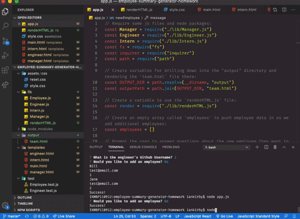

  # Employee Summary Generator Homework

  ## Description
  This app prompts the user to answer questions about new employess within the CLI. Using this input, the app generates an HTML page containing cards with new employees' details.

  ## Table of Contents
  * [Installation](#installation)
  * [Usage](#usage)
  * [License](#license)
  * [Contributing](#contributing)
  * [Tests](#tests)
  * [Questions](#questions)
  
  
  ## Installation
  Enter 'npm i' in the CLI.
  
  
  ## Usage
  Run the app by typing 'node app.js' into the Terminal, then answer a series of questions, which will generate a new team.html file (in the 'output' folder) based on your responses.

  

  
  ## License
  
      
  
  ## Contributing
  We take all forms of contributions but prefer Bitcoin. Kidding! 

  
  ## Tests
  Try to break this thing and let me know what you find :)

  
  ## Questions?
  Please feel free to reach out to me with any questions.

  GitHub Profile: <a href='https://github.com/vertjames'>vertjames</a>  
    
  _ _ _